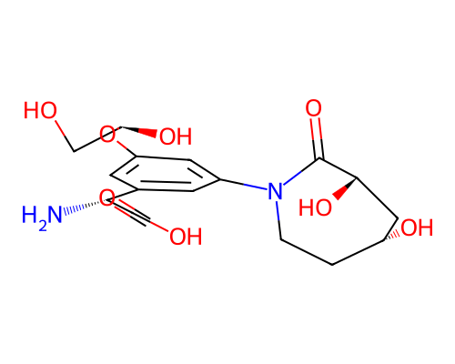

# Blueprint Report -- 001.sdf

> **Disclaimer:** This is a computational structural and synthesizability estimate. No in-body efficacy, toxicity, or physiological behavior is predicted or implied anywhere in this report. Wet-lab / biomolecular specialist review is required before any synthesis is attempted.

## G.1 Molecular Identity

- **Molecular formula:** C16H22N2O8
- **Canonical SMILES:** `N[C@@H](C(=O)O)c1cc(O[C@@H](O)CO)cc(N2CC[C@@H](O)C[C@H](O)C2=O)c1`
- **Molecular weight:** 370.14 Da
- **LogP:** -1.69
- **QED:** 0.319
- **SA score:** 0.660 (1=easy, 10=hard)
- **RA score:** 0.064 (real RA-score model)
- **Vina Dock:** -9.59 kcal/mol (ligand efficiency: -0.369 kcal/mol per heavy atom)

## G.2 Protein-Ligand Interaction Analysis (docked-pose geometry)

*Method: PLIP (typed interactions).*

| Residue | Chain | Interaction type | Closest distance (A) |
|---|---|---|---|
| VAL46 | A | hydrogen bond | 3.12 |
| GLU56 | A | hydrogen bond | 2.96 |
| TYR126 | B | hydrogen bond | 2.92 |
| SER28 | A | hydrogen bond | 3.83 |
| CYS88 | A | hydrogen bond | 2.84 |
| HIS48 | A | hydrogen bond | 2.4 |
| ASN45 | A | hydrogen bond | 2.93 |
| ALA55 | A | hydrogen bond | 2.95 |
| VAL29 | A | hydrophobic contact | 3.55 |
| ASN45 | A | hydrophobic contact | 3.99 |
| TYR47 | A | hydrophobic contact | 3.45 |
| ALA76 | A | hydrophobic contact | 3.97 |
| PHE49 | C | hydrophobic contact | 3.98 |
| ARG82 | A | salt bridge | 3.32 |

*All statements above describe the geometry of the docked/generated pose only (e.g. "residue X sits within Y A of the ligand, consistent with a hydrogen bond") -- no claim of biological/physiological effect is made or implied.*

## G.3 Synthesis Blueprint

**No concrete retrosynthetic route is included** -- AiZynthFinder was checked and found incompatible with this environment (pins numpy<2.0 and rdkit<2024, both conflicting with the validated diffusion/guidance stack); see blueprint_report.py module docstring. The figures below are feasibility estimates only.

- **RA score:** 0.064 (real RA-score model)
- **SA score:** 0.66 (fragment familiarity: 1.136, 26 atoms, 4 chiral centers, 0 spiro atoms, 0 bridgeheads, 0 macrocycles)

- **Lipinski Ro5 (structural flag, Lipinski et al. 1997):** 1 violation(s)
  - ✓ Molecular weight < 500 Da
  - ✗ H-bond donors <= 5
  - ✓ H-bond acceptors <= 10
  - ✓ LogP between -2 and 5
  - ✓ Rotatable bonds <= 10
- **PAINS filter (structural flag, Baell & Holloway 2010):** no alerts
