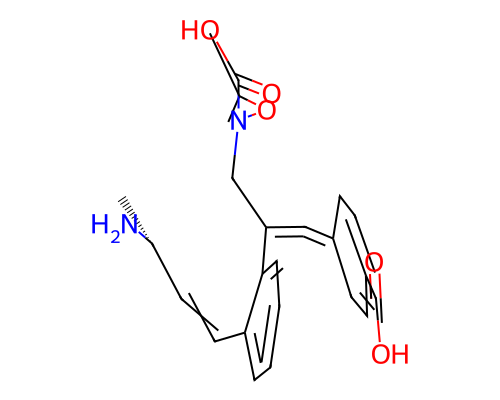

# Blueprint Report -- 001.sdf

> **Disclaimer:** This is a computational structural and synthesizability estimate. No in-body efficacy, toxicity, or physiological behavior is predicted or implied anywhere in this report. Wet-lab / biomolecular specialist review is required before any synthesis is attempted.

## G.1 Molecular Identity

- **Molecular formula:** C24H28N2O5
- **Canonical SMILES:** `CC(C)ON(CC(=C=C1C=CC(C(=O)O)=CC1)c1ccccc1C=C[C@@H](C)N)C(=O)O`
- **Molecular weight:** 424.2 Da
- **LogP:** 4.25
- **QED:** 0.425
- **SA score:** 0.630 (1=easy, 10=hard)
- **RA score:** 0.435 (real RA-score model)
- **Vina Dock:** -9.49 kcal/mol (ligand efficiency: -0.306 kcal/mol per heavy atom)

## G.2 Protein-Ligand Interaction Analysis (docked-pose geometry)

*Method: PLIP (typed interactions).*

| Residue | Chain | Interaction type | Closest distance (A) |
|---|---|---|---|
| TYR22 | A | hydrogen bond | 2.36 |
| SER150 | A | hydrogen bond | 3.01 |
| ARG152 | A | hydrogen bond | 3.09 |
| THR115 | A | hydrogen bond | 2.98 |
| THR91 | A | hydrogen bond | 3.54 |
| THR115 | A | hydrogen bond | 3.7 |
| TYR62 | A | hydrophobic contact | 3.56 |
| TYR90 | A | hydrophobic contact | 3.86 |
| TYR22 | A | hydrophobic contact | 3.63 |
| LEU147 | A | hydrophobic contact | 3.41 |
| ARG152 | A | salt bridge | 4.27 |

*All statements above describe the geometry of the docked/generated pose only (e.g. "residue X sits within Y A of the ligand, consistent with a hydrogen bond") -- no claim of biological/physiological effect is made or implied.*

## G.3 Synthesis Blueprint

**No concrete retrosynthetic route is included** -- AiZynthFinder was checked and found incompatible with this environment (pins numpy<2.0 and rdkit<2024, both conflicting with the validated diffusion/guidance stack); see blueprint_report.py module docstring. The figures below are feasibility estimates only.

- **RA score:** 0.435 (real RA-score model)
- **SA score:** 0.63 (fragment familiarity: 0.624, 31 atoms, 1 chiral centers, 0 spiro atoms, 0 bridgeheads, 0 macrocycles)

- **Lipinski Ro5 (structural flag, Lipinski et al. 1997):** 0 violation(s)
  - ✓ Molecular weight < 500 Da
  - ✓ H-bond donors <= 5
  - ✓ H-bond acceptors <= 10
  - ✓ LogP between -2 and 5
  - ✓ Rotatable bonds <= 10
- **PAINS filter (structural flag, Baell & Holloway 2010):** no alerts
