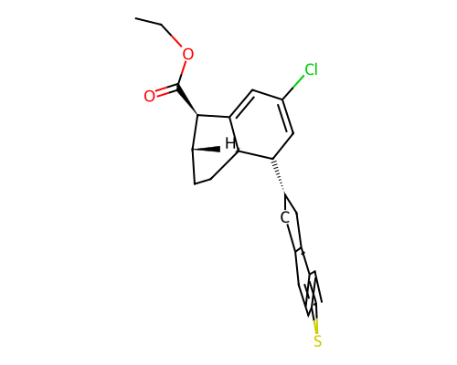

# Blueprint Report -- 001.sdf

> **Disclaimer:** This is a computational structural and synthesizability estimate. No in-body efficacy, toxicity, or physiological behavior is predicted or implied anywhere in this report. Wet-lab / biomolecular specialist review is required before any synthesis is attempted.

## G.1 Molecular Identity

- **Molecular formula:** C26H29ClO2S
- **Canonical SMILES:** `CCOC(=O)[C@H]1C2=CC(Cl)=CC([C@H]3Cc4ccc5sc(C)cc5c4C3)[C@@H]2CC[C@H]1C`
- **Molecular weight:** 440.16 Da
- **LogP:** 6.83
- **QED:** 0.489
- **SA score:** 0.600 (1=easy, 10=hard)
- **RA score:** 0.030 (real RA-score model)
- **Vina Dock:** -12.60 kcal/mol (ligand efficiency: -0.420 kcal/mol per heavy atom)

## G.2 Protein-Ligand Interaction Analysis (docked-pose geometry)

*Method: PLIP (typed interactions).*

| Residue | Chain | Interaction type | Closest distance (A) |
|---|---|---|---|
| TYR609 | A | hydrogen bond | 3.3 |
| ILE261 | A | hydrophobic contact | 3.71 |
| TYR420 | A | hydrophobic contact | 3.8 |
| PHE605 | A | hydrophobic contact | 3.93 |
| TRP169 | A | hydrophobic contact | 3.05 |
| ILE261 | A | hydrophobic contact | 3.18 |
| PRO263 | A | hydrophobic contact | 3.43 |
| TRP489 | A | hydrophobic contact | 3.45 |
| PHE601 | A | hydrophobic contact | 3.46 |
| LEU607 | A | hydrophobic contact | 3.31 |

*All statements above describe the geometry of the docked/generated pose only (e.g. "residue X sits within Y A of the ligand, consistent with a hydrogen bond") -- no claim of biological/physiological effect is made or implied.*

## G.3 Synthesis Blueprint

**No concrete retrosynthetic route is included** -- AiZynthFinder was checked and found incompatible with this environment (pins numpy<2.0 and rdkit<2024, both conflicting with the validated diffusion/guidance stack); see blueprint_report.py module docstring. The figures below are feasibility estimates only.

- **RA score:** 0.030 (real RA-score model)
- **SA score:** 0.6 (fragment familiarity: 0.946, 30 atoms, 5 chiral centers, 0 spiro atoms, 0 bridgeheads, 0 macrocycles)

- **Lipinski Ro5 (structural flag, Lipinski et al. 1997):** 1 violation(s)
  - ✓ Molecular weight < 500 Da
  - ✓ H-bond donors <= 5
  - ✓ H-bond acceptors <= 10
  - ✗ LogP between -2 and 5
  - ✓ Rotatable bonds <= 10
- **PAINS filter (structural flag, Baell & Holloway 2010):** no alerts
