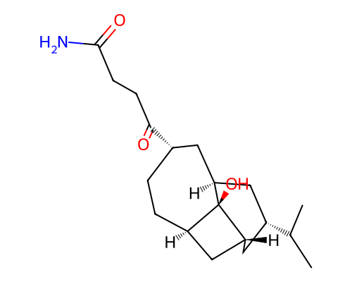

# Blueprint Report -- 005.sdf

> **Disclaimer:** This is a computational structural and synthesizability estimate. No in-body efficacy, toxicity, or physiological behavior is predicted or implied anywhere in this report. Wet-lab / biomolecular specialist review is required before any synthesis is attempted.

## G.1 Molecular Identity

- **Molecular formula:** C19H31NO3
- **Canonical SMILES:** `CC(C)[C@@H]1C[C@@H]2C[C@H]3CC[C@H](C(=O)CCC(N)=O)C[C@@H](C1)[C@@]32O`
- **Molecular weight:** 321.23 Da
- **LogP:** 2.67
- **QED:** 0.817
- **SA score:** 0.610 (1=easy, 10=hard)
- **RA score:** 0.379 (real RA-score model)
- **Vina Dock:** -8.78 kcal/mol (ligand efficiency: -0.382 kcal/mol per heavy atom)

## G.2 Protein-Ligand Interaction Analysis (docked-pose geometry)

*Method: PLIP (typed interactions).*

| Residue | Chain | Interaction type | Closest distance (A) |
|---|---|---|---|
| ILE60 | A | hydrogen bond | 3.97 |
| GLN86 | A | hydrogen bond | 3.02 |
| ASN125 | A | hydrogen bond | 2.79 |
| THR138 | A | hydrogen bond | 2.68 |
| THR140 | A | hydrogen bond | 3.98 |
| GLN86 | A | hydrogen bond | 3.83 |
| TYR65 | A | hydrophobic contact | 3.32 |
| GLN86 | A | hydrophobic contact | 3.85 |
| LEU142 | A | hydrophobic contact | 3.8 |
| TYR65 | A | hydrophobic contact | 3.14 |
| TYR65 | A | hydrophobic contact | 3.25 |
| TYR65 | A | hydrophobic contact | 3.14 |

*All statements above describe the geometry of the docked/generated pose only (e.g. "residue X sits within Y A of the ligand, consistent with a hydrogen bond") -- no claim of biological/physiological effect is made or implied.*

## G.3 Synthesis Blueprint

**No concrete retrosynthetic route is included** -- AiZynthFinder was checked and found incompatible with this environment (pins numpy<2.0 and rdkit<2024, both conflicting with the validated diffusion/guidance stack); see blueprint_report.py module docstring. The figures below are feasibility estimates only.

- **RA score:** 0.379 (real RA-score model)
- **SA score:** 0.61 (fragment familiarity: 0.894, 23 atoms, 6 chiral centers, 0 spiro atoms, 0 bridgeheads, 0 macrocycles)

- **Lipinski Ro5 (structural flag, Lipinski et al. 1997):** 0 violation(s)
  - ✓ Molecular weight < 500 Da
  - ✓ H-bond donors <= 5
  - ✓ H-bond acceptors <= 10
  - ✓ LogP between -2 and 5
  - ✓ Rotatable bonds <= 10
- **PAINS filter (structural flag, Baell & Holloway 2010):** no alerts
