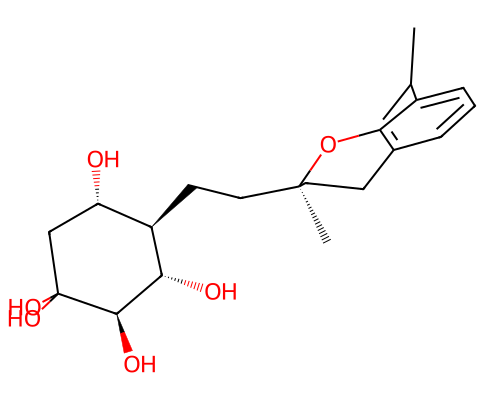

# Blueprint Report -- 008.sdf

> **Disclaimer:** This is a computational structural and synthesizability estimate. No in-body efficacy, toxicity, or physiological behavior is predicted or implied anywhere in this report. Wet-lab / biomolecular specialist review is required before any synthesis is attempted.

## G.1 Molecular Identity

- **Molecular formula:** C21H32O6
- **Canonical SMILES:** `CC(C)c1cccc2c1O[C@](C)(CC[C@H]1[C@H](O)[C@@H](O)C(O)(O)C[C@@H]1O)CC2`
- **Molecular weight:** 380.22 Da
- **LogP:** 1.46
- **QED:** 0.506
- **SA score:** 0.610 (1=easy, 10=hard)
- **RA score:** 0.007 (real RA-score model)
- **Vina Dock:** -10.57 kcal/mol (ligand efficiency: -0.392 kcal/mol per heavy atom)

## G.2 Protein-Ligand Interaction Analysis (docked-pose geometry)

*Method: PLIP (typed interactions).*

| Residue | Chain | Interaction type | Closest distance (A) |
|---|---|---|---|
| GLN79 | A | hydrogen bond | 3.9 |
| THR82 | A | hydrogen bond | 3.26 |
| ASN54 | A | hydrogen bond | 3.84 |
| THR82 | A | hydrogen bond | 3.26 |
| ARG273 | A | hydrogen bond | 3.18 |
| TRP80 | A | hydrophobic contact | 3.71 |
| THR82 | A | hydrophobic contact | 3.85 |
| LEU210 | A | hydrophobic contact | 3.75 |
| LEU264 | A | hydrophobic contact | 3.61 |
| TRP80 | A | hydrophobic contact | 3.63 |
| TRP80 | A | hydrophobic contact | 3.87 |
| LEU264 | A | hydrophobic contact | 3.69 |

*All statements above describe the geometry of the docked/generated pose only (e.g. "residue X sits within Y A of the ligand, consistent with a hydrogen bond") -- no claim of biological/physiological effect is made or implied.*

## G.3 Synthesis Blueprint

**No concrete retrosynthetic route is included** -- AiZynthFinder was checked and found incompatible with this environment (pins numpy<2.0 and rdkit<2024, both conflicting with the validated diffusion/guidance stack); see blueprint_report.py module docstring. The figures below are feasibility estimates only.

- **RA score:** 0.007 (real RA-score model)
- **SA score:** 0.61 (fragment familiarity: 0.894, 27 atoms, 5 chiral centers, 0 spiro atoms, 0 bridgeheads, 0 macrocycles)

- **Lipinski Ro5 (structural flag, Lipinski et al. 1997):** 0 violation(s)
  - ✓ Molecular weight < 500 Da
  - ✓ H-bond donors <= 5
  - ✓ H-bond acceptors <= 10
  - ✓ LogP between -2 and 5
  - ✓ Rotatable bonds <= 10
- **PAINS filter (structural flag, Baell & Holloway 2010):** no alerts
